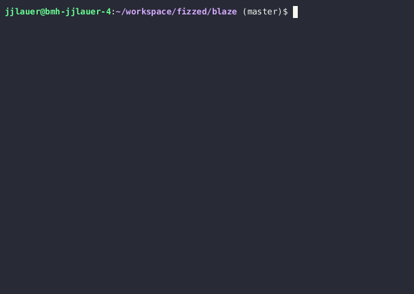

Blaze by Fizzed
=======================================

[](https://mvnrepository.com/artifact/com.fizzed/blaze)

[](https://github.com/fizzed/blaze/actions/workflows/linux-java8.yaml)
[](https://github.com/fizzed/blaze/actions/workflows/linux-java11.yaml)
[](https://github.com/fizzed/blaze/actions/workflows/linux-java17.yaml)
[](https://github.com/fizzed/blaze/actions/workflows/linux-java21.yaml)

[](https://github.com/fizzed/blaze/actions/workflows/linux-java8.yaml)
[](https://github.com/fizzed/blaze/actions/workflows/macos-x64.yaml)
[](https://github.com/fizzed/blaze/actions/workflows/macos-arm64.yaml)
[](https://github.com/fizzed/blaze/actions/workflows/macos-x64.yaml)

## Overview

A speedy, flexible, general purpose scripting and application launching stack for
the JVM.  Can replace shell scripts and plays nicely with other tools.  Only
requires a Java 8 runtime and adding `blaze.jar` to your project directory.  Start
writing portable and cross-platform scripts.



Blaze pulls together stable, mature libraries from the Java ecosystem into a
light-weight package that lets you focus on getting things done.  When you 
invoke blaze, it does the following:

 - Sets up console logging
 - Loads your optional configuration file(s)
 - Downloads runtime dependencies (e.g. jars from Maven central)
 - Loads and compiles your script(s)
 - Executes "tasks" (methods your script defines)

Includes the following features:

- Write your applications (scripts) in whatever JVM language you prefer.
  Out-of-the-box support for
   - Java (.java) (8, 11, 17, 21, etc.)
   - Groovy (.groovy) (v4.0.15)
   - Kotlin (.kt) (v1.9.10)
   - JavaScript (.js) (via nashorn on Java 11+)
   - Or write your own (examples [here](blaze-core/src/main/java/com/fizzed/blaze/jdk), [here](blaze-kotlin/src/main/java/com/fizzed/blaze/kotlin), and [here](blaze-groovy/src/main/java/com/fizzed/blaze/groovy))
- Zero-install required. Just drop `blaze.jar` into your project directory and
  you or others can run it with `java -jar blaze.jar`.
- [IDE support](https://github.com/fizzed/blaze#ide-support)
- Small size so you can commit `blaze.jar` to your repository
- Excellent framework support for executing processes, modifying the filesystem,
  user interaction, http, and ssh.
- Easily use any Java library as a dependency to accomplish whatever
  the framework doesn't provide.

## Sponsorship & Support


Project by [Fizzed, Inc.](http://fizzed.com) (Follow on Twitter: [@fizzed_inc](http://twitter.com/fizzed_inc))

**Developing and maintaining opensource projects requires significant time.** If you find this project useful or need
commercial support, we'd love to chat. Drop us an email at [ping@fizzed.com](mailto:ping@fizzed.com)

Project sponsors may include the following benefits:

- Priority support (outside of Github)
- Feature development & roadmap
- Priority bug fixes
- Privately hosted continuous integration tests for their unique edge or use cases

## What is a blaze script?

A Blaze script is a 100% valid JVM class with public methods that typically uses
an empty (root) package declaration.  Each public method becomes the externally
accessible task that can be called from the command-line. Since most JVM languages
support this kind of structure, Blaze can easily support a wide variety of
JVM languages.

## More documentation

 - [Why Blaze?](docs/WHY.md)
 - [Examples](docs/EXAMPLES.md)
 - [Configuration and dependency management](docs/CONFIG.md)
 - [Basic usage](docs/BASIC.md)
 - [SSH plugin](docs/SSH.md)
 - [HTTP plugin](docs/HTTP.md)

## Try It

To give this project a quick try on your own machine, just run some of the examples:

    git clone https://github.com/fizzed/blaze.git
    cd blaze
    java -jar blaze.jar examples/hello.java
    java -jar blaze.jar examples/natives.java
    java -jar blaze.jar examples/find_javas.java

## Install to your project

Download `blaze.jar` to your project directory.  If you have `wget` available

    wget -O blaze.jar 'https://repo1.maven.org/maven2/com/fizzed/blaze-lite/1.5.2/blaze-lite-1.5.2.jar'

If you have `curl` available

    curl -o blaze.jar 'https://repo1.maven.org/maven2/com/fizzed/blaze-lite/1.5.2/blaze-lite-1.5.2.jar'

Or simply [download the file in your web browser](https://repo1.maven.org/maven2/com/fizzed/blaze-lite/1.5.2/blaze-lite-1.5.2.jar)
and save it to your project directory with a name of `blaze.jar`

## Write hello world blaze script in .java

Create `blaze.java` file

```java
public class blaze {
    
    public void main() {
        System.out.println("Hello World!");
    }
    
}
```

## Run blaze script

Since you named your file `blaze.java`, Blaze will find it automatically.  You
can run it like so

    java -jar blaze.jar

If no task is supplied on the command line, Blaze will attempt to run the `main`
task by default.

## Write script that executes a process

Let's do a more useful example of how we use Blaze in many cases.  Let's say
you had a Maven project and wanted to execute a class with a main method. The
syntax to do that in Maven becomes difficult to remember and communicate to
other developers.  Blaze lets you simplify the entry points to your project
by exposing everything as named tasks.

```java
import static com.fizzed.blaze.Systems.exec;

public class blaze {

    public void demo1() {
        exec(
           "mvn", "compile", "exec:java", "-Dexec.classpathScope=runtime",
           "-Dexec.mainClass=com.example.Demo1").run();
    }

    public void demo2() {
        exec(
           "mvn", "compile", "exec:java", "-Dexec.classpathScope=runtime",
           "-Dexec.mainClass=com.example.Demo2").run();
    }
}
```

You can now just run these with `java -jar blaze.jar demo1` or `java -jar blaze.jar demo2`

## But I can still do your previous example in a shell script?

Yeah, I suppose so.  But you'd probably use two shell scripts to define the
separate tasks and if you cared about platform portability, you'd be nice to
also include `.bat` scripts for Windows users.  However, when you want to do
anything else that's remotely advanced, you'll start to appreciate having a
more advanced environment.

An example of finding a specific JDK on your local system to execute a Maven test with it.

find_java.conf
```java
blaze.dependencies = [
  "com.fizzed:jne:4.1.1"
]
```

find_java.java
```java
public class blaze {

   private final Logger log = Contexts.logger();
   private final Config config = Contexts.config();
   private final Path projectDir = withBaseDir("..").toAbsolutePath();
    
   @Task
   public void test() throws Exception {
      // optional command-line arguments to control which jdk version or hardware architecture
      final Integer jdkVersion = this.config.value("jdk.version", Integer.class).orNull();
      final HardwareArchitecture jdkArch = ofNullable(this.config.value("jdk.arch").orNull())
              .map(HardwareArchitecture::resolve)
              .orElse(null);

      final long start = System.currentTimeMillis();
      final JavaHome jdkHome = new JavaHomeFinder()
              .jdk()
              .version(jdkVersion)
              .hardwareArchitecture(jdkArch)
              .preferredDistributions()
              .sorted(jdkVersion != null || jdkArch != null)  // sort if any criteria provided
              .find();

      log.info("");
      log.info("Detected {} (in {} ms)", jdkHome, (System.currentTimeMillis()-start));
      log.info("");

      exec("mvn", "clean", "test")
              .workingDir(projectDir)
              .env("JAVA_HOME", jdkHome.getDirectory().toString())
              .verbose()
              .run();
   }
    
}
```

Another example where we query git for the latest tag and use it to update a README file with it.  We use this as a way
to maintain a README file with the latest version pushed to Maven central

```java
import com.fizzed.blaze.Contexts;
import static com.fizzed.blaze.Contexts.withBaseDir;
import static com.fizzed.blaze.Contexts.fail;
import static com.fizzed.blaze.Systems.exec;
import com.fizzed.blaze.core.Actions;
import com.fizzed.blaze.core.Blaze;
import com.fizzed.blaze.util.Streamables;
import java.io.BufferedWriter;
import java.io.IOException;
import java.nio.file.Files;
import java.nio.file.Path;
import java.nio.file.StandardCopyOption;
import java.util.regex.Matcher;
import java.util.regex.Pattern;
import org.slf4j.Logger;

public class blaze {
    static private final Logger log = Contexts.logger();
    
    private String latest_tag() {
        // get latest tag from git
        return exec("git", "describe", "--abbrev=0", "--tags")
            .runCaptureOutput()
            .toString()
            .trim();
    }
    
    public void update_readme() throws IOException {
        Path readmeFile = withBaseDir("../README.md");
        Path newReadmeFile = withBaseDir("../README.md.new");
        
        // find latest version via git tag, trim off leading 'v'
        String taggedVersion = latest_tag().substring(1);
        
        log.info("Tagged version: {}", taggedVersion);
        
        // find current version in readme using a regex to match
        // then apply a mapping function to return the first group of each match
        // then we only need to get the first matched group
        String versionRegex = ".*lite-(\\d+\\.\\d+\\.\\d+)\\.jar.*";
        String readmeVersion
            = Streamables.matchedLines(input(readmeFile), versionRegex, (m) -> m.group(1))
                .findFirst()
                .get();
        
        log.info("Readme version: {}", readmeVersion);
        
        if (readmeVersion.equals(taggedVersion)) {
            log.info("Versions match (no need to update README)");
            return;
        }
        
        // replace version in file and write a new version
        final Pattern replacePattern = Pattern.compile(readmeVersion);
        try (BufferedWriter writer = Files.newBufferedWriter(newReadmeFile)) {
            Files.lines(readmeFile)
                .forEach((l) -> {
                    Matcher matcher = replacePattern.matcher(l);
                    String newLine = matcher.replaceAll(taggedVersion);
                    try {
                        writer.append(newLine);
                        writer.append("\n");
                    } catch (IOException e) {
                        throw new UncheckedIOException(e);
                    }
                });
            writer.flush();
        }
        
        // replace readme with updated version
        Files.move(newReadmeFile, readmeFile, StandardCopyOption.REPLACE_EXISTING);
    }
}
```

## Optionally install blaze on your PATH

While you can invoke `blaze.jar` as an executable jar by running

    java -jar blaze.jar

Sometimes it's more convenient to have a system-wide executable installed on
your PATH to make that even shorter.  Blaze has a built-in method to copy a
wrapper script to a directory.  On Linux or Mac OSX, you can run the following

    sudo java -jar blaze.jar -i /usr/local/bin

On Windows, open up a shell as an administrator (Start Menu -> Command Prompt >
right mouse click Run as administrator), then run the following

    java -jar blaze.jar -i C:\Windows\System32

Depending on your operating system, this will install either a `blaze` shell
script or a `blaze.bat` batch script.  Assuming `/usr/local/bin` or `C:\Windows\System32`
is already on your PATH (which normally it is), then you can now just run
the following in your shell

    blaze

## IDE support

Writing your blaze scripts in an IDE is significantly more productive than trying to write them in a text editor. We
initially tried writing our own IDE plugins to automatically recognize blaze was present, but that proved too difficult
to maintain over IDE versions.  As of Blaze v1.5.2+, there is a new simple method to enable IDE support across any
IDE that supports Maven projects.

    java -jar blaze.jar --generate-maven-project

This command will leverage the location of the script currently being executed, calculate the dependencies it needs to
run, and then create a minimal pom.xml in the same directory.  You can then open that pom.xml in any IDE, and you'll get
all the full blown features of your IDE to efficiently write and maintain your blaze scripts.

The ```--generate-maven-project``` command will set the target source version to Java 8 by default. If you need to override
this to something else, you can add a [blaze-script].conf file that is associated with your blaze script, and add the
following configuration values:

    java.source.version = 11

You can also pass this is on the command line:

    blaze --generate-maven-project -Djava.source.version=17

## Where to save your script(s)

Blaze is designed to play nicely with other popular JVM build tools such as Maven,
Gradle, Ant, SBT, etc.  Blaze is also designed to play nicely with your favorite
IDE.  If you are planning on a blaze-only project, then create a `blaze.[ext]`
file in your project directory (at the same level as your `blaze.jar`).  Your
project directory would be

    <project directory>/
        blaze.jar
        blaze.[ext]

The `[ext]` would be whatever JVM language you'd like to write your script in.
So java would be `.java`, groovy would be `.groovy`, etc.

However, if you are using another build tool such as Maven, we'd suggest creating
a sub-directory called `.blaze` or `blaze` and placing your `blaze.[ext]` script in there.
Most Java IDEs compute classpaths for auto completion based on directory paths
and placing your script in the root directory doesn't work very well with IDEs like
Netbeans.  So a maven project + blaze would be

    <project directory>/
        .blaze/
            blaze.[ext]
        blaze.jar
        pom.xml

In either setup, you'd run your script identically.  That's because blaze will
first search the current directory for `blaze.[ext]` then `.blaze/blaze.[ext]`
then `blaze/blaze.[ext]`

If you'd like to have more than one script, you can supply it on the command-line
like so

    java -jar blaze.jar path/to/script.[ext]
